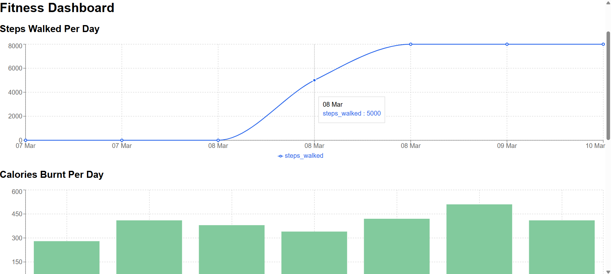

# Fitness Insights

## 📌 Overview
Fitness Insights is a multi-modal fitness tracking application that allows users to log and analyze their fitness journey. Users can input daily fitness data such as steps walked, calories burned, weight, and sleep hours. The system provides insights through AI-generated summaries and visual dashboards.

### 🔥 Features
- **User Authentication**: Secure login and registration with JWT authentication.
- **Multi-modal Input**: Users can input text, voice recordings, and media files.
- **LLM Integration**: AI-generated insights based on fitness data.
- **Data Visualization**: Graphs for steps, calories, sleep, and weight changes.
- **MongoDB Database**: Stores user fitness logs securely.
- **Dark Minimalist UI**: Built using React and TailwindCSS.

---
## ⚡ Tech Stack
### **Frontend**
- React.js
- TailwindCSS
- Recharts (for data visualization)
- Axios (for API requests)

### **Backend**
- Flask (Python)
- Flask-JWT-Extended (for authentication)
- Flask-PyMongo (MongoDB integration)
- OpenAI API (for AI-generated insights)
- Whisper (for voice transcription)

### **Database**
- MongoDB with GridFS (for media storage)

---
## 🚀 Setup Instructions

### **1️⃣ Clone the Repository**
```sh
  git clone https://github.com/JunioeEvidence/Fitness-insights.git
  cd Fitness-insights
```

### **2️⃣ Backend Setup**
#### Navigate to Backend Folder:
```sh
cd backend
```
#### Create a Virtual Environment (Recommended):
```sh
python -m venv venv
source venv/bin/activate  # Mac/Linux
venv\Scripts\activate    # Windows
```
#### Install Dependencies:
```sh
pip install -r requirements.txt
```
#### Setup Environment Variables:
Create a `.env` file in `backend/` and add:
```env
MONGO_URI=mongodb://localhost:27017/fitness_insights
SECRET_KEY=your_secret_key
JWT_SECRET_KEY=your_jwt_secret_key
LLM_API_KEY=your_openai_api_key
```
#### Run the Backend Server:
```sh
flask run
```

---

### **3️⃣ Frontend Setup**
#### Navigate to Frontend Folder:
```sh
cd ../frontend
```
#### Install Dependencies:
```sh
npm install
```
#### Start the Frontend:
```sh
npm start
```

---
## 🛠️ Usage
- **Login/Register**: Create an account or log in.
- **Data Input**: Enter fitness details manually or via voice.
- **Dashboard**: View AI-generated insights and data visualizations.

---
## 📝 API Endpoints
| Method | Endpoint | Description |
|--------|----------|-------------|
| POST | `/register` | Register a new user |
| POST | `/login` | Authenticate and receive a JWT token |
| POST | `/submit-text` | Submit fitness text logs |
| POST | `/submit-audio` | Upload an audio file for transcription |
| POST | `/upload-media` | Upload images/videos |
| POST | `/generate-insights` | Generate AI-powered insights |

---
## 📸 Screenshots



---
## 🤝 Contributing
Feel free to fork the repo and submit pull requests!

---
## 📜 License
This project is licensed under the MIT License.

---
## 📩 Contact
For any issues, contact: **shahswattiwari56789@gmail.com**

